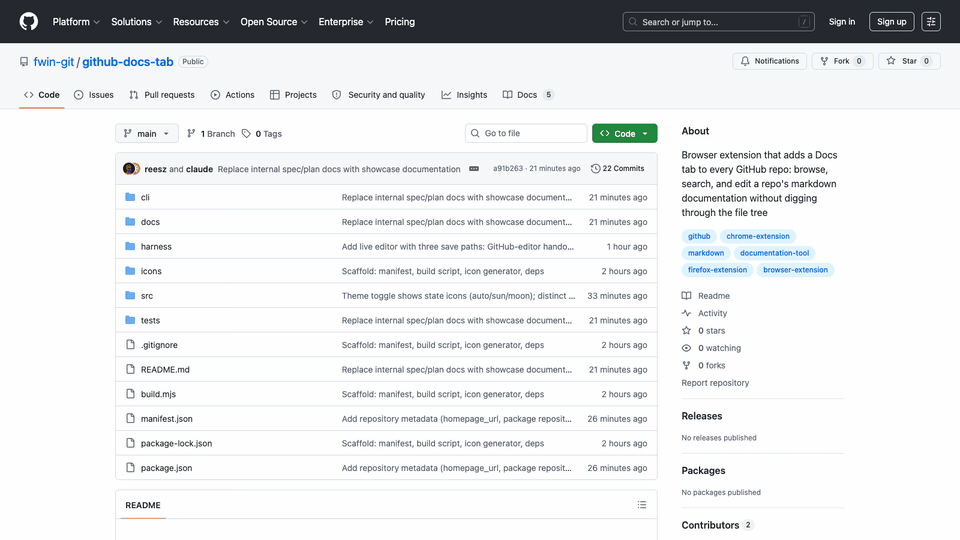
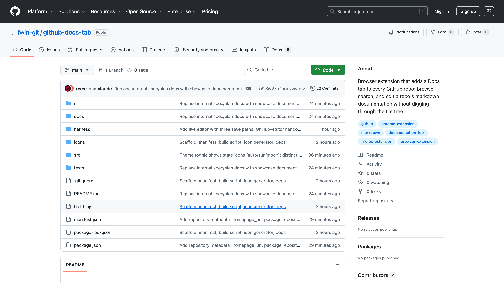
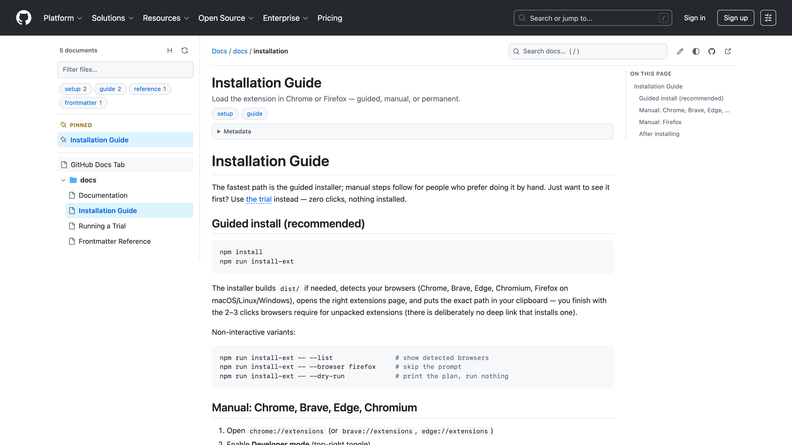
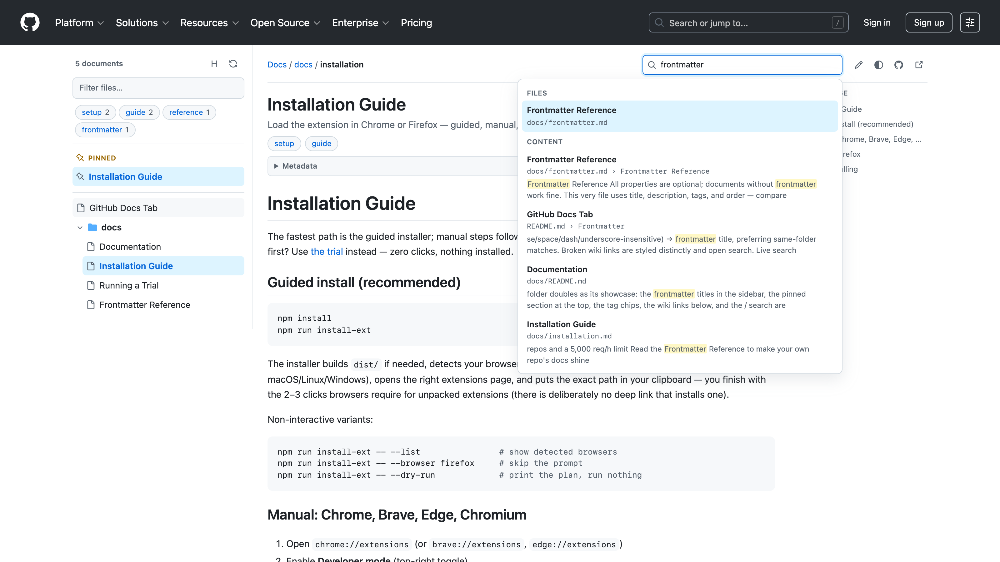
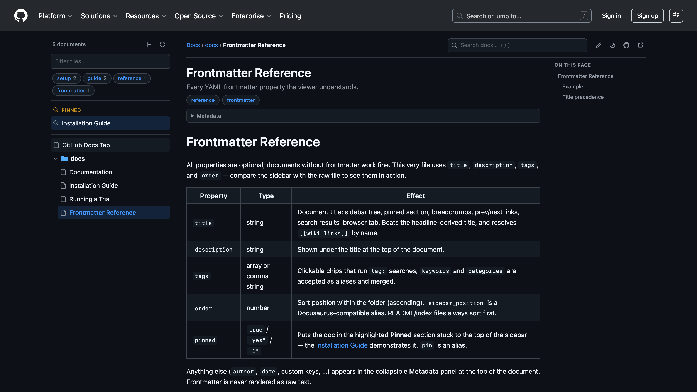

# GitHub Docs Tab

A browser extension for **Chrome and Firefox** that adds a **Docs** tab to every GitHub repository — right next to Code, Issues, and Pull requests. It collects the repo's markdown documentation (root files plus `docs/`-style folders at any nesting depth) and presents it as a proper documentation site: file tree, rendered markdown, cross-file links, wiki links, live search, tags, and light/dark theming — without ever leaving `github.com` or clicking through the file browser.

## Showcase



| Docs tab on the repo | Reading with sidebar & TOC | Live full-text search | Dark mode |
| --- | --- | --- | --- |
|  |  |  |  |

All assets above are generated by `npm run media` — a Puppeteer script that loads the built extension, drives this very repository, and captures 16:9 stills plus a screencast GIF.

## Quick start

```bash
npm install && npm run install-ext
```

Follow the prompts — the guided install finishes in 2–3 clicks (or use `-- --trial` for a zero-click throwaway session). Public repos work immediately; for **private repos** and the 5,000 req/h limit:

1. Create a **classic token** at [github.com/settings/tokens/new](https://github.com/settings/tokens/new) with the **`repo`** scope — that single scope covers reading private repos *and* the create-PR editing flow. (Fine-grained alternative: resource owner = your org, *Contents: Read* — plus *Contents/Pull requests: Read and write* if you want automatic PRs. If your org enforces SAML SSO, click **Configure SSO** on the token afterwards.)
2. Click the extension's toolbar icon → **Options** → paste the token → **Test** → **Save token**.
3. Confirm the *"Currently saved:"* line reads `ghp_…` (40 chars, classic), then reload any open GitHub tabs.

That's it — open any repository and click the **Docs** tab.

## Features

- **Docs tab with document count** injected into the repository navigation, shown whenever the repo contains markdown docs. Survives GitHub's soft (Turbo) navigation.
- **Documentation collection** from root markdown files (`README.md`, `CONTRIBUTING.md`, …) and conventional folders (`docs`, `doc`, `documentation`, `wiki`, `guides`, `handbook`, `manual`, `.github`, `website/docs` — configurable), matched at any depth, so monorepos (`packages/x/docs/…`) work.
- **Full markdown rendering** (GFM): tables, task lists, footnotes, autolinks, GitHub alerts (`> [!NOTE]` …), syntax-highlighted code fences with copy buttons, GitHub-style heading anchors with hover permalinks, mermaid fences shown as labeled source.
- **Linking between files**: relative links (`./other.md`, `../a/b.md#section`) navigate inside the viewer; links to markdown outside the collection load on demand; links to other repo files go to GitHub; external links open in a new tab. Images resolve to raw content automatically.
- **Wiki links**: `[[Page]]`, `[[Page|Label]]`, `[[Page#Heading]]`, `[[Page#Heading|Label]]`, `[[#Same-file heading]]`. Resolution by path → basename (case/space/dash/underscore-insensitive) → frontmatter title, preferring same-folder matches. Broken wiki links are styled distinctly and open search.
- **Live search** (`/` to focus): instant filename fuzzy matching plus full-text search once the background index finishes (progress shown). Supports `"exact phrases"` and `tag:x` filters; results show highlighted snippets and jump to matched headings.
- **Organization-wide docs** (building icon in the sidebar): index the docs of many repositories at once and search across all of them — see [Organization-wide search](#organization-wide-search) below.
- **In-viewer editing with drafts** (pencil icon): edit any document in a live source+preview editor, stage several files as **drafts**, then publish the whole session as one pull request — see [Editing documents](#editing-documents) below.
- **Copy document markdown** (copy icon in the toolbar): copies the current document's raw markdown source to the clipboard in one click.
- **YAML frontmatter support**: `title` (used in sidebar/breadcrumbs), `description`, `tags`/`keywords`/`categories` (clickable chips + `tag:` search), `order`/`sidebar_position` (sidebar ordering), `pinned: true`/`pin: true` (pinned section at the top of the sidebar), plus a collapsible metadata panel for everything else. Frontmatter is never rendered as raw text.
- **Sidebar**: file tree with folder icons and collapsible directories, a live filter field, pinned docs section, tag chips, and document count. README/index files sort first, then frontmatter order, then natural sort.
- **Title mode toggle** (H/file icon next to refresh): show each document as its **title** — YAML frontmatter `title:` first; otherwise the first highest headline (an h1 anywhere in the file wins; if there is no h1, the first h2, and so on); otherwise the filename — or as its plain **filename**. The choice persists.
- **Reading aids**: "On this page" table of contents with scroll-spy, breadcrumbs, previous/next navigation, reading-position deep links.
- **Light/dark mode**: follows GitHub's active theme automatically (including dim variants) via GitHub's CSS variables, with a manual auto → light → dark override.
- **Shareable URLs**: viewer state lives in the fragment — `https://github.com/owner/repo#docs/docs/guide.md?h=install` reloads and shares cleanly (people without the extension simply see the repo).
- **Private repos & rate limits**: works anonymously on public repos (60 API requests/hour, softened by ETag caching — 304 revalidations are free). Add a personal access token in Options for 5,000/hour and private repositories.

## Installation

```bash
npm install && npm run install-ext
```

The interactive installer detects your browsers (Chrome, Brave, Edge, Chromium, Firefox), opens the right extensions page, and puts the exact path in your clipboard — you finish with the 2–3 clicks browsers require for unpacked extensions. Manual steps and a permanent-Firefox path are in the **[Installation Guide](docs/installation.md)**.

Want to see it before installing anything? `npm run install-ext -- --trial` launches a throwaway session with the extension pre-loaded and lands on this very repository, Docs tab and all — details in **[Running a Trial](docs/trial.md)**.

## Usage

- Visit any GitHub repository. If it has markdown docs, a **Docs** tab appears with a count badge.
- Click it (or open `…#docs` directly). The URL tracks the current document and heading, so links are shareable.
- Press `/` to search. Use `tag:guide`, `"exact phrase"`, or plain terms. `Esc` closes.
- Use the sidebar filter field to narrow the file tree as you type.
- Pin important docs to the top of the sidebar with `pinned: true` in their frontmatter.
- **Sidebar header** (left → right): the **building** icon opens organization-wide search, the **H/file** icon toggles title vs. filename mode, and the **refresh** icon re-fetches the doc list.
- **Top bar actions** (right): the **chain-link** copies a deep link to the current document (including the heading you're at), **copy** grabs the document's raw markdown, the **pencil** opens the in-viewer editor, the **theme** icon cycles auto → light → dark (its glyph shows the current mode: half-circle / sun / moon), and the **↗** icons open or edit the file on GitHub. Deep links look like `https://github.com/owner/repo#docs/path.md?h=heading` and open straight to that document.
- **Extension popup** (toolbar icon): token status, a list of cached repositories (each links to its Docs tab, with age and per-repo eviction), and cache-clearing.

## Frontmatter

Docs can declare `title`, `description`, `tags`, `order`/`sidebar_position`, and `pinned` in YAML frontmatter — the viewer uses them for sidebar titles, clickable tag chips with `tag:` search, ordering, and the pinned section, and shows everything else in a collapsible metadata panel. The full property table, example, and title-precedence rules are in the **[Frontmatter Reference](docs/frontmatter.md)** — which, like everything under `docs/`, doubles as a live showcase when you open this repo's Docs tab.

## Editing documents

The pencil button in the viewer's toolbar opens a **live editor**: markdown source on the left, an instantly updating preview on the right — rendered by exactly the same pipeline as the viewer (wiki links, alerts, highlighting, all of it) — plus a formatting toolbar (bold/italic/code/headings/lists/tasks/links/wiki links). It is deliberately a source editor with live preview rather than contentEditable WYSIWYG: HTML→markdown round-trips corrupt formatting and produce noisy diffs, which matters when the output becomes a commit.

Saving is always an explicit, confirmed step, with three routes:

1. **Propose via GitHub editor** — no token needed. Your edit is stashed locally and the extension navigates to GitHub's own file editor (`/edit/…`), where it pre-fills your changes; you review and press GitHub's native **Commit changes…** button, so the commit/branch/fork/PR flow runs entirely through GitHub's UI under your logged-in account. (The extension cannot — and should not — commit directly with your browser session: those endpoints are CSRF-protected by design.) If auto-fill fails on a GitHub editor redesign, a toast offers your edited content for one-click copy.
2. **Create pull request…** — fully automatic, requires an API token (options) with *Contents* and *Pull requests* write permission. Creates a branch from the default branch, commits the single-file change, and opens a PR — using your fork automatically when you lack push access. You get the PR link when it's done.
3. **Download .patch / Copy patch** — no auth at all. A standard unified diff (`git apply file.patch` or `patch -p1 < file.patch`), generated locally.

**Drafting & batch publishing:** instead of publishing each file immediately, **Save draft** stages the edit locally (per repository, surviving reloads). Drafted files get a dot in the sidebar tree and collect in a **Drafts** section, where you can keep editing, discard individually, or — once you're done with the whole session — hit **Publish session…**: one branch, one commit per file, one pull request (auto-fork as usual), or download the entire session as a single multi-file `.patch`.

## Organization-wide search

Documentation for an organization is usually spread across many repositories. The **building icon** in the sidebar header lets you browse and search all of it from one place.

1. **Pick repositories.** A dialog lists every repository in the organization (or user account). It has a **filter field** (matches name and description), **All / None** buttons that act on the currently filtered rows, and remembers your last selection. Archived repos are listed but unchecked by default.
2. **Watch it index.** Each selected repository gets its own row with a **progress bar** (listing → files indexed → done, green on success or red with the error on failure), above an **overall progress bar**. Listings reuse the per-repo ETag cache, so re-indexing later is mostly free 304s.
3. **Browse and search across everything.** The sidebar switches to a view **grouped by repository** (collapsible, current repo first, with per-repo doc counts and a small **index ring** — empty/faded when a repo is available but not indexed, filling while it indexes, green when it's searchable), and live search grows an **Organization** results group. Selecting any cross-repo hit opens that document in its own repository's Docs tab — instant, because the listing is already cached. The **×** in the org bar returns to single-repo view (and leaves org mode, so it won't auto-restore).
4. **It sticks — without the request storm.** Once you've indexed an organization, opening the Docs tab on *any* of its repositories restores the grouped sidebar automatically from the remembered listings. Content is **not** re-fetched on every page load; instead unindexed repos appear faded with an **empty ring**, and you index on demand:
   - the **↻ button** in the org bar indexes every repository for search;
   - **expanding an unindexed repo** prompts *"Index this repo, or just browse?"* — "Index" fetches only that one, "Just browse" lets you navigate its files (from the cached listing) without any content fetch;
   - the repository you're currently viewing is folded into the index for free (its content is already loaded).

> A GitHub token is effectively required here — indexing dozens of repositories will use their share of requests. Add one in **Options** (a classic token with the `repo` scope is simplest). The remembered snapshot keeps the sidebar instant across reloads; only the repos you choose to index make content requests.

## Options

Click the extension icon → **Options**:

| Setting | Default | Notes |
| --- | --- | --- |
| Access token | — | Fine-grained token with read-only *Contents* is enough. Stored in local extension storage, sent only to `api.github.com`. |
| Documentation folders | `docs, doc, documentation, wiki, guides, guide, handbook, manual, .github, website/docs` | One per line; matched case-insensitively at any depth; `a/b` patterns match consecutive segments. |
| Include root markdown files | on | README, CONTRIBUTING, etc. |
| Docs tab count badge | on | |
| Maximum documents | 500 | Larger repos show a truncation notice. |
| Content-index size limit | 200 KB/file | Larger files are skipped by full-text search (still viewable). |

## Privacy

No telemetry, no external services. The extension talks exclusively to `api.github.com` and `raw.githubusercontent.com`, requests only the `storage` permission, runs only on `https://github.com/*`, and stores settings/caches in your browser's extension storage. All rendered markdown is sanitized with DOMPurify before insertion.

## Development

```bash
npm install
npm test           # unit tests (node:test) for all pure logic
npm run build      # bundle to dist/
npm run zip        # build + store zips in artifacts/
npm run watch      # rebuild bundles on change
npm run icons      # regenerate icons (deterministic, dependency-free)
node harness/serve.mjs   # http://localhost:8631/acme/widget — fixture repo page
```

The harness serves a fake GitHub repo page with stubbed `chrome.storage` and GitHub APIs, so the full content script can be exercised in a plain browser tab (no extension install needed).

The `docs/` folder is user documentation and doubles as the extension's live showcase (frontmatter, wiki links, pinned docs). Pure logic (path resolution, frontmatter, slugs, docs collection, wiki-link resolution, search, markdown plugins, cache policy) is in ESM modules under `src/common/` + `src/content/` and covered by tests; browser integration (tab injection, viewer, routing) is verified through the harness.

## Releases & CI

Every push and pull request runs the **CI** workflow (`.github/workflows/ci.yml`): unit tests, a full build, bundle syntax checks, and manifest validation.

Releases are automated (`.github/workflows/release.yml`) and produce a GitHub Release with the built **Chrome** and **Firefox** zips attached plus auto-generated change notes (the commits since the previous tag). Two ways to cut one:

- **Tag push** — bump `version` in `manifest.json` and `package.json`, commit, then:
  ```bash
  git tag v0.1.1 && git push origin v0.1.1
  ```
  The workflow verifies the tag matches the manifest version, builds, and publishes.
- **Manual dispatch** — in the repo's **Actions → Release → Run workflow**, enter a version (e.g. `0.1.1`). It bumps the version files, commits, tags, builds, and publishes in one go.

Grab the attached zip from any release and load it unpacked (Chrome) or as a temporary add-on (Firefox) — see the [Installation Guide](docs/installation.md).

## Limitations

- GitHub Enterprise domains are not yet supported (github.com only).
- Mermaid/KaTeX render as labeled source rather than diagrams (keeps the bundle lean).
- `.mdx` files render as plain markdown (JSX stripped by sanitization) with a badge.
- Repos readable only with SSO-gated tokens follow whatever access the token grants.
